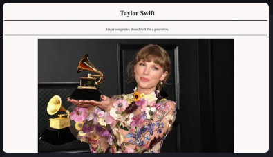

# Taylor Swift Tribute Page

## Preview

## Description
Apart of the Responsive Web Design certification, this was the second major project I worked on while working with freeCodeCamp. It's a static web page to pay tribute to the subject of my choosing. I choose Taylor Swift at the time because she had just released her 'Midnights' album and annouced her Eras Tour. The significant dates in her career listed on the site color coordinate with each era of her albums. The image used on the site is from [Billboard.com](https://www.billboard.com/wp-content/uploads/2021/11/Taylor-Swift-2021-grammy-billboard-1548.jpg?w=942&h=623&crop=1&resize=942%2C623).

## Objective
Build an app that is functionally similar to [this example](https://tribute-page.freecodecamp.rocks/).

## User Stories

**Fulfill the user stories and pass all the tests below to complete this project. Give it your own personal style. Happy Coding!**

1. Your tribute page should have a `main` element with a corresponding `id` of `main`, which contains all other elements.
2. You should see an element with an `id` of `title`, which contains a string (i.e. text), that describes the subject of the tribute page (e.g. "Dr. Norman Borlaug").
3. You should see either a `figure` or a `div` element with an `id` of `img-div`.
4. Within the `#img-div` element, you should see an `img` element with a corresponding `id="image"`.
5. Within the `#img-div` element, you should see an element with a corresponding `id="img-caption"` that contains textual content describing the image shown in `#img-div`.
6. You should see an element with a corresponding `id="tribute-info"`, which contains textual content describing the subject of the tribute page.
7. You should see an `a` element with a corresponding `id="tribute-link"`, which links to an outside site, that contains additional information about the subject of the tribute page.
    - *HINT: You must give your element an attribute of `target` and set it to `_blank` in order for your link to open in a new tab*
9. Your `#image` should use `max-width` and `height` properties to resize responsively, relative to the width of its parent element, without exceeding its original size.
10. Your `img` element should be centered within its parent element

**Note:** Be sure to add `<link rel="stylesheet" href="styles.css">` in your `HTML` to link your stylesheet and apply your `CSS`

## Badges

## Listen to My Favorite Taylor Swift Songs on Spotify

